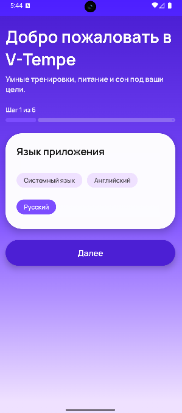
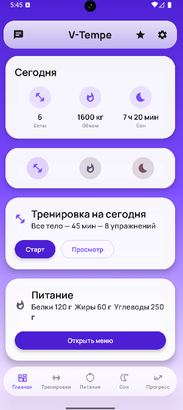
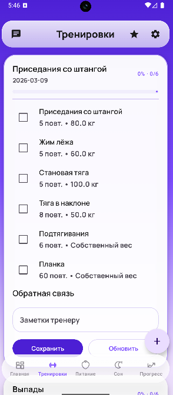
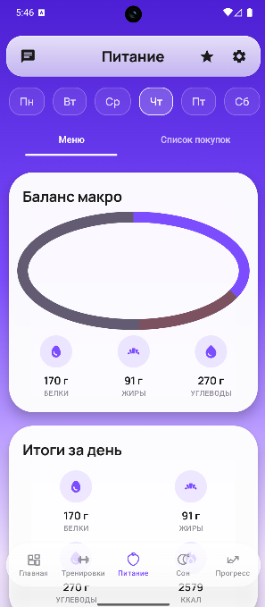
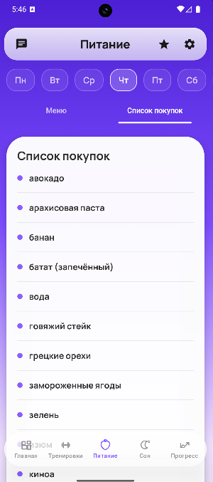
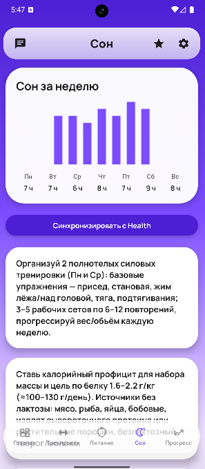
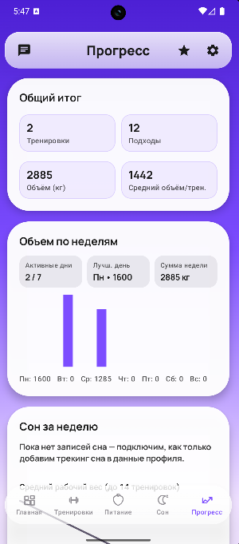
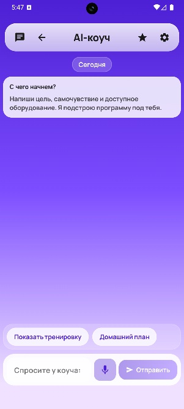
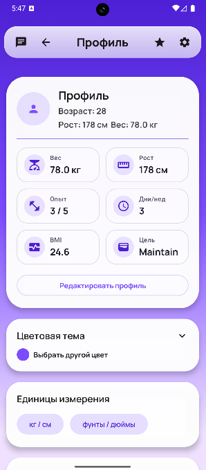
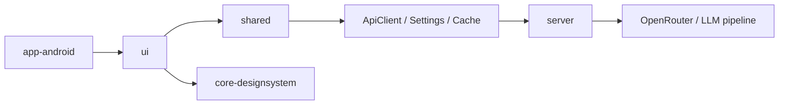

# V-Tempe

V-Tempe is an AI-powered fitness app built with Kotlin Multiplatform. It combines onboarding, personalized training plans, nutrition planning, sleep guidance, progress analytics, and an in-app AI coach chat into one product.

The repository currently includes:

- an Android client
- shared KMM domain/data layers
- a shared Compose UI module
- a small design system
- a Ktor backend for AI generation and chat

## Screenshots

The repository includes a real screenshot set under `docs/screenshots/`.
The current gallery uses Russian localization to show real in-app content.

| Onboarding | Home | Workout |
| --- | --- | --- |
|  |  |  |
| Guided first-run flow and profile setup. | Daily overview, quick actions, and key metrics. | Planned sets, exercise list, and coach notes. |

| Nutrition Plan | Shopping List | Sleep |
| --- | --- | --- |
|  |  |  |
| Macro balance and daily meal structure. | Ingredient checklist generated from the plan. | Weekly sleep trends and recovery guidance. |

| Progress | AI Coach | Profile and Settings |
| --- | --- | --- |
|  |  |  |
| Training volume, weekly trends, and analytics. | Profile-aware coaching chat with quick prompts. | User stats, units, theme, and AI mode entry point. |

## Product Overview

V-Tempe is designed around one main idea: collect a user profile once, then use it everywhere.

The app asks for:

- language
- age, sex, height, weight
- goal
- experience level
- available equipment
- dietary preferences
- allergies
- weekly workout schedule

That profile is then used to generate and adapt:

- training plans
- nutrition plans
- sleep advice
- AI chat responses

## What Already Works

- Guided onboarding flow with profile setup
- Home screen with daily overview and quick actions
- Workout screen with planned sessions, completed-set tracking, and post-workout notes
- Nutrition screen with weekly meal plan, macros, shopping list, and meal details
- Sleep screen with weekly chart and recovery tips
- Progress screen with workout, sleep, weight, and calorie analytics
- AI coach chat with quick prompts and profile-aware responses
- Settings screen with theme, language, units, and AI mode selection
- Ktor backend with `/ai/*` endpoints
- Paid/free AI mode switching with cache-based fallback on the client

## Main User Flows

| Flow | What the user gets |
| --- | --- |
| Onboarding | A profile that powers all AI features |
| Home | A compact daily dashboard |
| Workout | Planned sets, completion tracking, notes, manual set entry |
| Nutrition | Weekly menu, macros, shopping list, meal detail |
| Sleep | Weekly sleep view and basic advice |
| Progress | Aggregated metrics and charts |
| Chat | AI coach answers tailored to the user profile |
| Settings | Theme, language, units, AI mode, profile entry point |

## Architecture



## Modules

| Module | Responsibility |
| --- | --- |
| `app-android` | Android launcher, Android-specific wiring, `BuildConfig.API_BASE_URL` |
| `ui` | Shared Compose screens, presenters, localized resources |
| `shared` | Domain models, repositories, use cases, Ktor client, preferences, local cache |
| `core-designsystem` | Shared visual components, charts, palette, and reusable UI primitives |
| `server` | Ktor backend, AI services, LLM integration, repair/extraction pipeline |
| `app-ios` | iOS entry point for Compose UIViewController |
| `iosApp` | iOS host project |

## Tech Stack

- Kotlin Multiplatform
- Jetpack Compose / Compose Multiplatform
- Material 3
- Ktor Client / Ktor Server
- Koin
- kotlinx.serialization
- russhwolf `Settings`
- Napier
- OpenRouter

## Backend API

Current backend routes:

- `GET /health`
- `POST /ai/bootstrap`
- `POST /ai/training`
- `POST /ai/nutrition`
- `POST /ai/sleep`
- `POST /ai/chat`

`/ai/bootstrap` is the most convenient endpoint when you want training, nutrition, and advice prepared together.

## AI Modes

The app supports two AI modes:

- `paid`
- `free`

The selected mode is stored in preferences and sent with the user profile. The backend can switch from the paid client to the free client if needed, and the mobile client can fall back to cached results when a request fails.

If `OPENROUTER_API_KEY` is missing, the backend still starts, but it returns stubbed responses instead of real AI output.

## Getting Started

### Requirements

- JDK 17
- Android Studio
- Android SDK 24+
- Xcode if you want to run the iOS host

### 1. Run the backend

Create `server/.env.local` or `.env.local` in the project root.

Minimal example:

```env
PORT=8081
OPENROUTER_API_KEY=your_key_here
OPENROUTER_MODEL=openrouter/auto
OPENROUTER_FREE_MODEL=google/gemma-3-27b-it:free
OPENROUTER_REQUEST_TIMEOUT_MS=180000
OPENROUTER_RETRY_ATTEMPTS=2
```

Start the server:

```bash
./gradlew :server:run
```

Health check:

```bash
curl http://localhost:8081/health
```

### 2. Run the Android app

The Android debug build is already configured to use:

```text
http://10.0.2.2:8081
```

That value is defined in `app-android/build.gradle.kts`.

Build:

```bash
./gradlew :app-android:assembleDebug
```

Install on emulator:

```bash
./gradlew :app-android:installDebug
```

If your backend runs on another host or port, update `BuildConfig.API_BASE_URL` in `app-android/build.gradle.kts`.

### 3. iOS

The repo already contains the iOS entry point and host project, but the primary actively used flow in this repo is Android + shared/ui + backend. iOS validation should be done separately in Xcode.

## Backend Environment Variables

Important server variables:

- `PORT`
- `OPENROUTER_API_KEY`
- `OPENROUTER_FREE_API_KEY`
- `OPENROUTER_MODEL`
- `OPENROUTER_FREE_MODEL`
- `OPENROUTER_FALLBACK_MODELS`
- `OPENROUTER_FREE_FALLBACK_MODELS`
- `OPENROUTER_ENABLE_AUTO_FALLBACK`
- `OPENROUTER_FREE_ENABLE_AUTO_FALLBACK`
- `OPENROUTER_REQUEST_TIMEOUT_MS`
- `OPENROUTER_SOCKET_TIMEOUT_MS`
- `OPENROUTER_CONNECT_TIMEOUT_MS`
- `OPENROUTER_RETRY_ATTEMPTS`
- `AI_CHAT_TIMEOUT_MS`
- `AI_LLM_TIMEOUT_MS`

## Project Layout

```text
V-Tempe/
├── app-android/
├── app-ios/
├── core-designsystem/
├── docs/
│   └── screenshots/
├── iosApp/
├── server/
├── shared/
├── ui/
├── README.md
└── settings.gradle.kts
```

## Useful Commands

```bash
./gradlew :server:run
./gradlew :server:compileKotlin
./gradlew :app-android:assembleDebug
./gradlew :app-android:installDebug
```

## Key Files

- `ui/src/commonMain/kotlin/com/vtempe/ui/AppRoot.kt`
- `ui/src/commonMain/kotlin/com/vtempe/ui/screens/`
- `shared/src/commonMain/kotlin/com/vtempe/shared/domain/model/Models.kt`
- `shared/src/commonMain/kotlin/com/vtempe/shared/data/repo/`
- `server/src/main/kotlin/com/vtempe/server/app/Application.kt`
- `server/src/main/kotlin/com/vtempe/server/features/ai/api/AiRoutes.kt`
- `server/src/main/kotlin/com/vtempe/server/app/di/ServerModule.kt`

## Current Notes

- The app is already localized for English and Russian.
- There is explicit logic for repairing malformed AI text and sanitizing LLM output.
- Android debug is most convenient with the backend on port `8081`.
- Parts of monetization and health sync are still foundation-level rather than fully finished product integrations.

## Possible README Upgrades

Future polish I can still add:

- an English-only screenshot set
- short captions below each major feature section
- a feature-by-feature visual walkthrough
- request/response JSON examples for backend routes
- a cleaner landing-page style README layout
- GIF demos for onboarding, workout tracking, and AI chat
